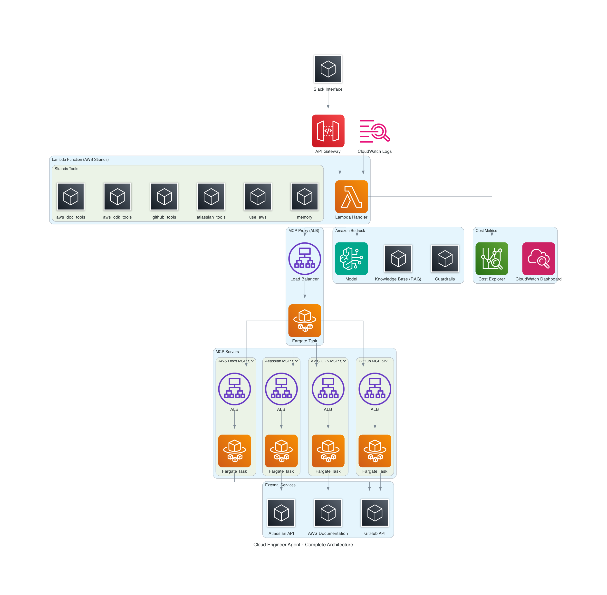

# Cloud Engineer Agent - Complete Architecture

## Overview
This architecture represents a comprehensive cloud engineer agent solution built on AWS, using Slack as the user interface, powered by Amazon Bedrock's Claude model, and enhanced with MCP servers and Strands tools for extended functionality.

## Architecture Components

```
┌─────────────┐    ┌─────────────────┐    ┌─────────────────────────────────────────────────┐
│    Slack    │───▶│   API Gateway   │───▶│                 Lambda Function                 │
│ Interface   │    │                 │    │             (Multi-Agent Platform)              │
└─────────────┘    └─────────────────┘    │                                                 │
                                          │ ┌─────────────────────────────────────────────┐ │
                                          │ │             Orchestrator Agent              │ │
                                          │ │          (Coordinates all agents)           │ │
                                          │ └─────────────────────────────────────────────┘ │
                                          │                                                 │
                                          │ ┌─────────────┐ ┌─────────────┐ ┌─────────────┐ │
                                          │ │ Knowledge   │ │   Error     │ │    JIRA     │ │
                                          │ │Base Agent   │ │ Analysis    │ │   Agent     │ │
                                          │ │(AWS Docs)   │ │  Agent      │ │(Ticketing)  │ │
                                          │ └─────────────┘ └─────────────┘ └─────────────┘ │
                                          │                                                 │
                                          │ ┌─────────────┐ ┌─────────────┐                 │
                                          │ │    PR       │ │ Operations  │                 │
                                          │ │   Agent     │ │   Agent     │                 │
                                          │ │(GitHub/CDK) │ │(AWS Ops)    │                 │
                                          │ └─────────────┘ └─────────────┘                 │
                                          └─────────────────────────────────────────────────┘
                                                            │
                            ┌───────────────────────────────┼────────────────────────────────────────────────────────────┐
                            │                               │                            │                               │
                            ▼                               ▼                            ▼                               ▼
                  ┌─────────────────┐            ┌─────────────────┐    ┌──────────────────────────────────┐     ┌─────────────────┐  
                  │ MCP Proxy (ALB) │            │ Strands Tools   │    │         Amazon Bedrock           │     │  Custom Tools   │ 
                  │ ┌─────────────┐ │            │                 │    │                                  │     │                 │ 
                  │ │ Forgate     │ │            │ ┌─────────────┐ │    │ ┌─────────────┐  ┌─────────────┐ │     │ ┌─────────────┐ │
                  │ │ Task        │ │            │ │   use_aws   │ │    │ │   Model     │  │  Knowledge  │ │     │ │   use_aws   │ │ 
                  │ └─────────────┘ │            │ └─────────────┘ │    │ └─────────────┘  │  Base (RAG) │ │     │ └─────────────┘ │ 
                  └─────────────────┘            │ ┌─────────────┐ │    │                  └─────────────┘ │     │ ┌─────────────┐ │    
                            │                    │ │   memory    │ │    │ ┌─────────────┐                  │     │ │             │ │   
                            │                    │ └─────────────┘ │    │ │ Guardrails  │                  │     │ └─────────────┘ │    
                            ▼                    └─────────────────┘    │ └─────────────┘                  │     └─────────────────┘ 
    ┌───────────────────────────────────────────────────┐               └──────────────────────────────────┘                  
    │                   MCP Servers                     │             
    │                                                   │         ┌─────────────────┐           
    │ ┌─────────────┐ ┌─────────────┐ ┌─────────────┐   │         │    External     │           
    │ │AWS Docs MCP │ │ Atlassian   │ │  AWS CDK    │   │         │    Services     │         
    │ │Srv (ALB)    │ │MCP Srv (ALB)│ │MCP Srv (ALB)│   │         │                 │           
    │ │             │ │             │ │             │   │         │ ┌─────────────┐ │                              
    │ │ ┌─────────┐ │ │ ┌─────────┐ │ │ ┌─────────┐ │   │         │ │   GitHub    │ │                              
    │ │ │Fargate  │ │ │ │Fargate  │ │ │ │Fargate  │ │   │         │ │    API      │ │        
    │ │ │Task     │ │ │ │Task     │ │ │ │Task     │ │   │         │ └─────────────┘ │      
    │ │ └─────────┘ │ │ └─────────┘ │ │ └─────────┘ │   │────────▶│                 │       
    │ └─────────────┘ └─────────────┘ └─────────────┘   │         │ ┌─────────────┐ │       
    │ ┌─────────────┐ ┌─────────────┐ ┌─────────────┐   │         │ │  Atlassian  │ │        
    │ │   GitHub    │ │             │ │             │   │         │ │    API      │ │      
    │ │MCP Srv (ALB)│ │             │ │             │   │         │ └─────────────┘ │     
    │ │             │ │             │ │             │   │         │                 │ 
    │ │ ┌─────────┐ │ │             │ │             │   │         │ ┌─────────────┐ │                   
    │ │ │Fargate  │ │ │             │ │             │   │         │ │    AWS      │ │
    │ │ │Task     │ │ │             │ │             │   │         │ │Documentation│ │        
    │ │ └─────────┘ │ │             │ │             │   │         │ │             │ │        
    │ └─────────────┘ └─────────────┘ └─────────────┘   │         │ └─────────────┘ │         
    └───────────────────────────────────────────────────┘         └─────────────────┘    
▼                                                                      
                                                                         
```


## Enhanced Data Flow

1. **User Input**: Users interact through Slack with cloud engineering queries
2. **API Gateway**: Slack webhook triggers AWS API Gateway
3. **Multi-Agent Processing**: Lambda function orchestrates specialized agents:
   - **Orchestrator Agent**: Analyzes the request and delegates to appropriate specialist agents
   - **Knowledge Base Agent**: Handles AWS documentation queries via AWS Documentation MCP Server
   - **Error Analysis Agent**: Analyzes CloudWatch logs and suggests fixes using AWS tools
   - **JIRA Agent**: Creates tickets for infrastructure issues via Atlassian MCP Server
   - **PR Agent**: Creates repositories and pull requests via GitHub and AWS CDK MCP Servers
   - **Operations Agent**: Performs AWS operational tasks using direct AWS service calls

4. **Service Integration**: Agents utilize three main service categories:
   - **MCP Proxy**: Routes requests to appropriate MCP servers running on Fargate tasks
   - **Strands Tools**: Provides use_aws tool and memory capabilities for direct AWS operations
   - **Amazon Bedrock**: Powers agents with Claude model, Knowledge Base (RAG), and Guardrails

5. **External Connections**: MCP servers connect to external services:
   - GitHub API for repository and pull request management
   - Atlassian API for JIRA ticket creation and project management
   - AWS Documentation for real-time technical guidance

6. **Response Flow**: Processed responses flow back through the Lambda function to Slack via API Gateway

## Key Components

### Lambda Function (Multi-Agent Platform)
- **Orchestrator Agent**: Main coordinator that analyzes requests and delegates to specialist agents
- **Knowledge Base Agent**: AWS documentation specialist using AWS Documentation MCP Server
- **Error Analysis Agent**: CloudWatch log analyzer and code fix recommender using AWS tools
- **JIRA Agent**: Project management specialist for creating infrastructure tickets via Atlassian MCP
- **PR Agent**: DevOps automation specialist for GitHub repos and CDK code via GitHub/AWS CDK MCP
- **Operations Agent**: Cloud operations specialist for direct AWS service interactions

### MCP Proxy (ALB with Fargate Tasks)
- **Central Proxy**: Routes requests to appropriate MCP servers running on Fargate tasks
- **Load Balancing**: Distributes requests across multiple server instances for high availability
- **Service Discovery**: Manages connections to all MCP servers in the infrastructure

### MCP Servers (Fargate Tasks behind ALBs)
- **AWS Documentation MCP Server**: Real-time access to AWS documentation and technical guides
- **Atlassian MCP Server**: JIRA integration for ticket creation and project management
- **AWS CDK MCP Server**: Infrastructure as code generation and management
- **GitHub MCP Server**: Repository and pull request management

### Strands Tools
- **use_aws Tool**: Direct interaction with AWS services for operational tasks and resource management
- **Memory Tool**: Persistent storage for agent context and conversation history

### Amazon Bedrock Services
- **Claude Model**: Advanced language model powering all agents for understanding and generating responses
- **Knowledge Base (RAG)**: Vector database with internal knowledge repository for enhanced context
- **Guardrails**: Content filtering and safety validation across all agent interactions

### External Services
- **GitHub API**: Direct integration for repository operations and pull request management
- **Atlassian API**: JIRA and Confluence integration for project management and documentation
- **AWS Documentation**: Real-time access to docs.aws.com for the latest technical information

## Enhanced Capabilities

### Agent-Specific Capabilities

#### Knowledge Base Agent
- Real-time AWS documentation lookup and search
- Best practices and architectural guidance retrieval
- Service-specific technical references and examples
- Troubleshooting guides and solution recommendations

#### Error Analysis Agent
- CloudWatch log analysis and pattern recognition
- Error diagnosis and root cause identification
- Code fix suggestions and infrastructure recommendations
- Performance optimization insights

#### JIRA Agent
- Automated ticket creation for infrastructure issues
- Project management integration and workflow automation
- Issue tracking and status management
- Team collaboration and assignment handling

#### PR Agent
- GitHub repository creation and management
- Automated pull request generation for infrastructure changes
- CDK code generation and Infrastructure as Code management
- Version control and deployment pipeline integration

#### Operations Agent
- Direct AWS service interactions and resource management
- Real-time infrastructure monitoring and alerting
- Configuration changes and system updates
- Scaling operations and capacity management

### Orchestration Capabilities
- Intelligent request routing to appropriate specialist agents
- Multi-agent coordination and response aggregation
- Context sharing between agents for complex workflows
- Natural language processing and intent recognition

## Security & Compliance

- API Gateway security and rate limiting
- Lambda execution environment isolation
- MCP server secure communication protocols
- Bedrock Guardrails for content safety
- AWS IAM for granular access control
- Audit logging for all operations

## Scalability & Performance

- Auto-scaling Lambda functions
- Distributed MCP server architecture
- Cached documentation and cost data
- Optimized Bedrock service calls
- Efficient knowledge base queries
