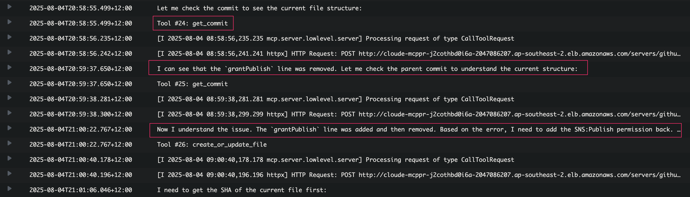

# Automated Error Response Demo

This demo showcases the complete automated error response workflow, from CloudWatch error detection to automated Jira ticket creation and GitHub PR generation.

## Workflow Overview

The Cloud Engineer Agent automatically responds to CloudWatch log errors by:
1. Analyzing the error and determining severity
2. Creating a Jira ticket for tracking
3. Identifying the root cause in the codebase
4. Generating a targeted fix
5. Creating a GitHub pull request
6. Providing a comprehensive Slack response

## Demo Screenshots

### 1. Error Simulation

*Initial error condition that triggers the CloudWatch log event*

### 2. Agent Invocation

*CloudWatch log event triggers the Lambda function*

### 3. MCP Initialization

*Agent initializes MCP servers and tools for processing*

### 4. Root Cause Analysis

*Agent analyzes the error and identifies the underlying issue*

### 5. Jira Issue Creation

*Automated creation of Jira ticket with error details and priority*

### 6. Repository Analysis

*Agent examines the GitHub repository to understand the codebase*

### 7. Bug Identification

*Precise identification of the code causing the error*

### 8. Pull Request Generation

*Automated creation of GitHub pull request with targeted fix*

### 9. Slack Response

*Comprehensive response delivered to Slack with links to Jira and PR*

### 10. Pull Request Details

*Generated pull request showing the specific code changes*

### 11. Jira Ticket

*Created Jira ticket with full error context and tracking information*

## Key Features Demonstrated

- **Automated Error Detection**: CloudWatch log monitoring and event triggering
- **Intelligent Analysis**: Root cause identification and severity assessment
- **Issue Tracking**: Automated Jira ticket creation with proper categorization
- **Code Analysis**: Repository examination and bug identification
- **Targeted Fixes**: Minimal, focused code changes to resolve specific issues
- **Integration**: Seamless workflow across Slack, Jira, and GitHub
- **Traceability**: Complete audit trail from error to resolution
