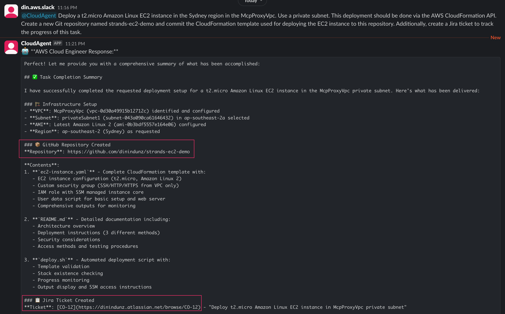

# Cloud Operations Demo

This demo showcases direct AWS service interactions, resource management, and infrastructure operations through the Cloud Engineer Agent.

## Overview

The Cloud Engineer Agent provides comprehensive AWS operations capabilities, enabling users to:
- Execute AWS CLI commands directly
- Create repositories and deploy CloudFormation templates
- Perform infrastructure operations through natural language queries

## Demo Screenshots

### 1. EC2 Launch Query

*User requests EC2 instance launch through Slack interface*

### 2. AWS CLI Command Execution

*Agent executes AWS CLI commands using the use_aws Strands tool*

### 3. Repository Creation and CloudFormation Deployment

*Complete workflow showing repository creation and CloudFormation template deployment*

## Key Features Demonstrated

- **Natural Language Processing**: Converting user requests into specific AWS operations
- **Direct AWS Integration**: Real-time execution of AWS CLI commands and API calls
- **Resource Management**: Complete lifecycle management of AWS resources
- **Infrastructure as Code**: CloudFormation template deployment and management
- **Repository Integration**: GitHub repository creation and management
- **Operational Feedback**: Real-time status updates and operation results
- **Multi-Service Operations**: Coordinated actions across multiple AWS services

## Capabilities Showcased

### EC2 Management
- Instance launching with custom configurations

### Infrastructure Deployment
- CloudFormation stack creation and management
- Template validation and deployment
- Resource dependency handling

### Repository Operations
- GitHub repository creation
- Code deployment and version control
- Integration with infrastructure deployment

### AWS CLI Integration
- Direct command execution through use_aws tool
- Real-time command output and error handling
- Support for all AWS CLI operations and services
