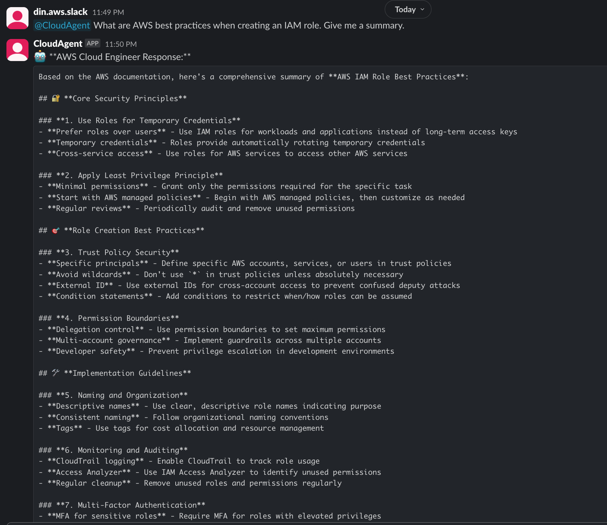
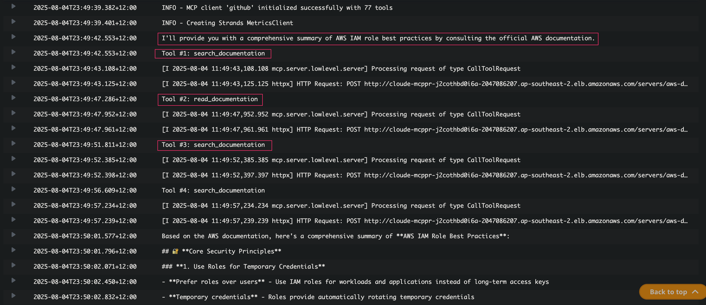

# General Queries Demo

This demo showcases AWS documentation lookup, best practices guidance, and expert recommendations through the Cloud Engineer Agent's knowledge capabilities.

## Overview

The Cloud Engineer Agent provides intelligent responses to general AWS queries by:
- Leveraging AWS Documentation MCP Server for authoritative information
- Providing best practices and architectural guidance
- Offering expert recommendations based on AWS standards
- Delivering contextual and actionable advice

## Demo Screenshots

### 1. IAM Role Best Practices Query

*User requests IAM role best practices guidance through Slack*

### 2. AWS Documentation MCP Integration

*Agent leverages AWS Documentation MCP server to provide authoritative responses*

## Key Features Demonstrated

- **Expert Knowledge Access**: Real-time access to comprehensive AWS documentation
- **Best Practices Guidance**: Authoritative recommendations following AWS standards
- **Contextual Responses**: Tailored advice based on specific use cases and scenarios
- **Documentation Integration**: Seamless integration with official AWS documentation sources
- **Interactive Learning**: Educational responses that help users understand AWS concepts

## Capabilities Showcased

### Documentation Lookup
- Real-time access to AWS service documentation
- Service-specific technical references and guides
- API documentation and usage examples
- Troubleshooting guides and common solutions

### Best Practices Guidance
- Security best practices and recommendations
- Architecture patterns and design principles
- Cost optimization strategies
- Performance and scalability guidelines

### Expert Recommendations
- Service selection guidance based on requirements
- Configuration recommendations for optimal performance
- Security hardening suggestions
- Compliance and governance advice

### Knowledge Integration
- Cross-service integration patterns
- Migration strategies and best practices
- Disaster recovery and backup recommendations
- Monitoring and observability guidance

## Use Cases Demonstrated

### Security Guidance
- IAM role configuration and best practices
- Security group and network ACL recommendations
- Encryption and key management guidance
- Access control and permission strategies

### Architectural Advice
- Service architecture recommendations
- Scalability and performance optimization
- Cost-effective solution design
- High availability and fault tolerance patterns
