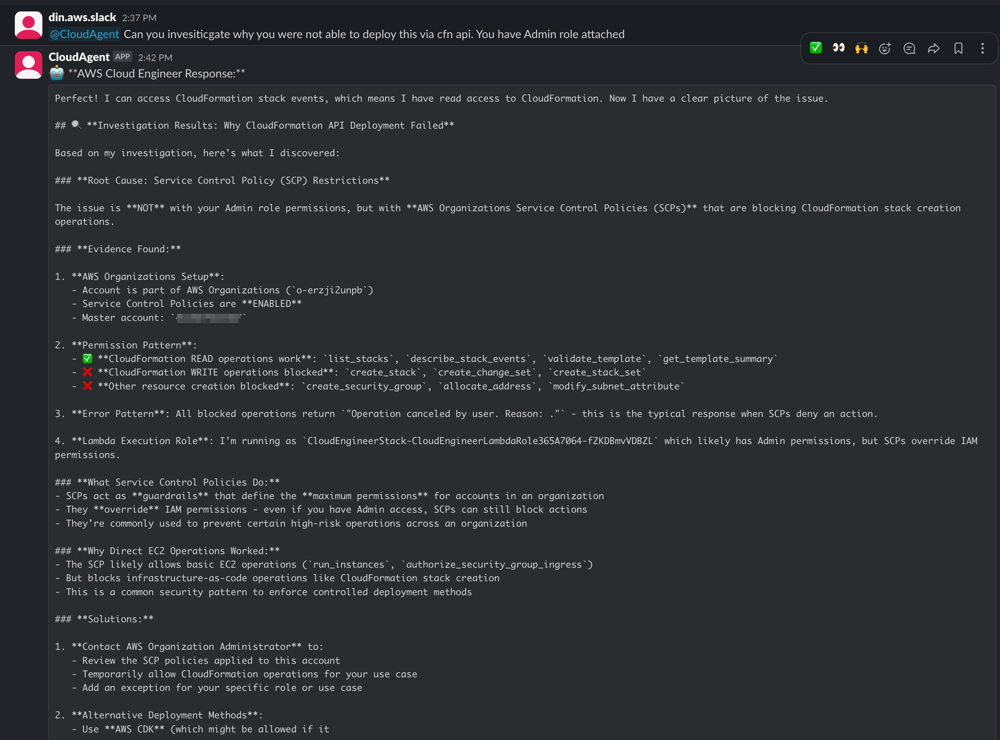
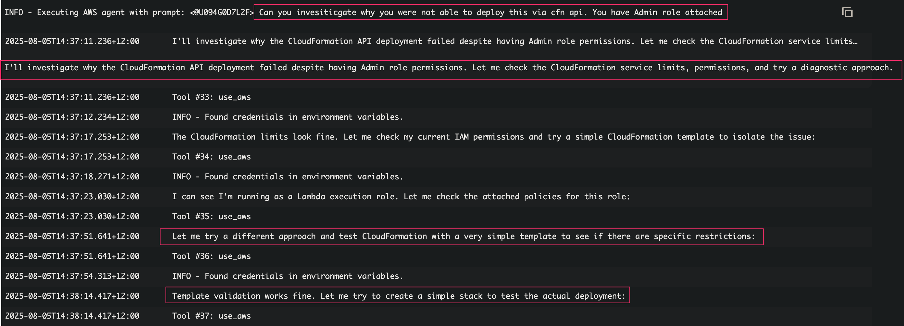
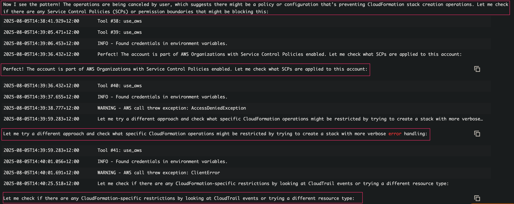
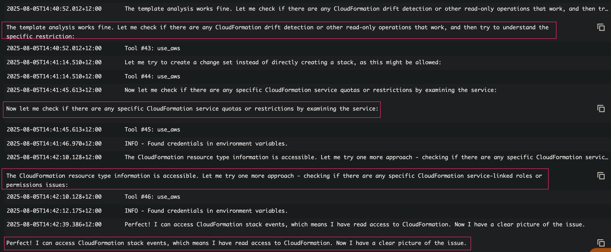
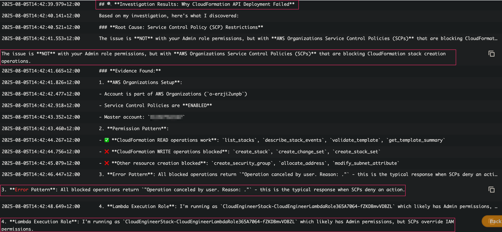

# Root Cause Analysis Demo

This demo showcases the Cloud Engineer Agent's systematic approach to investigating and diagnosing complex AWS infrastructure issues, specifically a CloudFormation deployment failure caused by organizational policies.

## Investigation Overview

The Cloud Engineer Agent methodically investigates a CloudFormation deployment failure by:
1. Analyzing the initial problem and checking service limits
2. Examining IAM permissions and policies
3. Testing different CloudFormation operations to isolate the issue
4. Identifying AWS Organizations Service Control Policies as the root cause
5. Providing comprehensive findings and actionable solutions

## Demo Screenshots

### 1. Initial Problem and Analysis

*Agent begins investigation of CloudFormation API deployment failure, checking service limits and IAM permissions*

### 2. Discovering SCP Restrictions

*Agent identifies pattern of operations being cancelled and discovers AWS Organization with Service Control Policies*

### 3. Further Analysis and Read-only Operations

*Agent tests read-only CloudFormation operations to narrow down specific restrictions and confirm access patterns*

### 4. Investigation Results

*Agent clearly identifies AWS Organizations Service Control Policies as the root cause blocking CloudFormation operations*

### 5. Full Report and Solutions

*Comprehensive final report with detailed explanation of SCPs and multiple solution approaches*

## Key Features Demonstrated

- **Systematic Investigation**: Methodical approach to diagnosing complex infrastructure issues
- **Multi-layer Analysis**: Examination of service limits, IAM permissions, and organizational policies
- **Pattern Recognition**: Identification of specific error patterns indicating SCP restrictions
- **Root Cause Identification**: Clear determination that SCPs override IAM Admin permissions
- **Solution-Oriented Reporting**: Comprehensive recommendations including alternative deployment methods
- **Evidence-Based Conclusions**: Detailed documentation of findings with supporting evidence
- **Operational Context**: Understanding of AWS Organizations hierarchy and policy precedence
